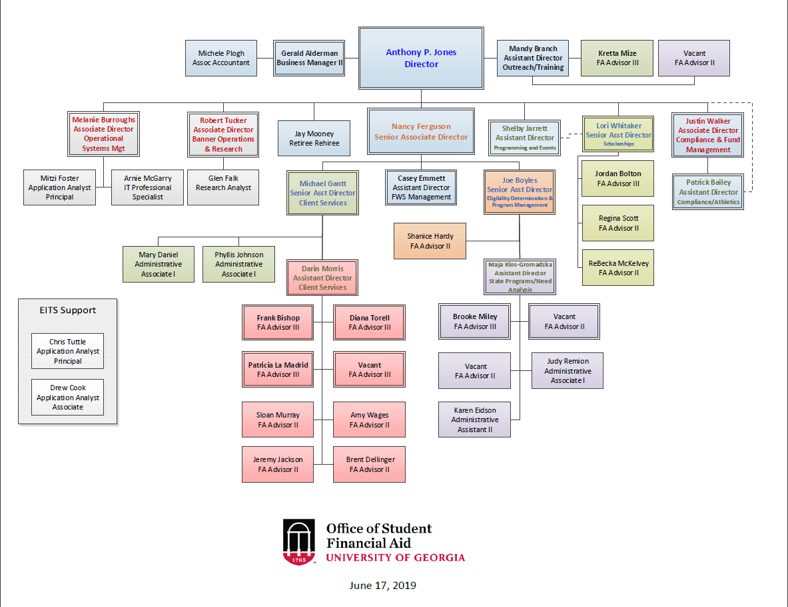

## Table of Contents

- [01. Student Financial Aid Summary](#intro)
    - [Student Financial Aid Summary Undergraduate Cost of Attendance](#student-financial-aid-summary-undergraduate-cost-of-attendance)
    - [Financial Aid Applications and Awards](#financial-aid-applications-and-awards)
        - [Student Aid Applications](#student-aid-applications)
        - [Scholarships, Grants & Waivers](#scholarships,-grants-&-waivers)
        - [Loans](#loans)
        - [Student Employment](#student-employment)
        - [Debt of Undergraduate Students Graduating With Student Loans](#debt-of-undergraduate-students-graduating-with-student-loans)
    - [Total Student Aid](#total-student-aid)
    - [Undergraduate Scholarships & Grants by Source](#undergraduate-scholarships-&-grants-by-source)

- [02. Undergraduate Cost of Attendance](#intro)
    - [Undergrad COA Percentage of Total Cost](#undergrad-coa-percentage-of-total-cost)
    - [Grad Resident COA](#grad-resident-coa)
    - [Grad Non-Resident COA](#grad-non-resident-coa)

- [03. Financial Aid Awarded to Students - Five-Year Comparison](#intro)
    - [Average Award Per Undergraduate Recipient chart](#average-award-per-undergraduate-recipient-chart)
    - [Average Award Per Graduate Recipient Chart](#average-award-per-graduate-recipient-chart)

- [04. Types and Sources of Aid](#intro)
    - [Financial Aid Awarded: Sources of Financial Aid Table](#financial-aid-awarded:-sources-of-financial-aid-table)
    - [Financial Aid Awarded: Sources of Financial Aid Chart](#financial-aid-awarded:-sources-of-financial-aid-chart)
    - [Financial Aid Awarded: Types of Financial Aid Table](#financial-aid-awarded:-types-of-financial-aid-table)
    - [Financial Aid Awarded: Types of Financial Aid Chart](#financial-aid-awarded:-types-of-financial-aid-chart)

- [05. Academic Year Student Financial Aid Awards by Type](#intro)
    - [Academic Year Student Financial Aid Awards by Type Table\elandscape](#academic-year-student-financial-aid-awards-by-type-table\elandscape)

- [06. HOPE Scholarship Awards by Tier](#intro)
    - [Financial Aid Awarded: Sources of Financial Aid Table\elandscape](#financial-aid-awarded:-sources-of-financial-aid-table\elandscape)
    - [HOPE Scholarship Awards by Tier](#hope-scholarship-awards-by-tier)
    - [HOPE Scholarship Awards by Tier](#hope-scholarship-awards-by-tier)
    - [Percent Change in HOPE Scholarship Awards by Tier](#percent-change-in-hope-scholarship-awards-by-tier)

- [06. ZELL Scholarship Awards by Tier](#intro)
    - [Financial Aid Awarded: Sources of Financial Aid Table\elandscape](#financial-aid-awarded:-sources-of-financial-aid-table\elandscape)
    - [ZELL Scholarship Awards by Tier](#zell-scholarship-awards-by-tier)
    - [ZELL Scholarship Awards by Tier](#zell-scholarship-awards-by-tier)
    - [Percent Change in ZELL Scholarship Awards by Tier](#percent-change-in-zell-scholarship-awards-by-tier)

- [07. HOPE-ZELL Scholarship Awards by Tier](#intro)
    - [Percent of Undergraduates with HOPE/Zell Scholarship Awards](#percent-of-undergraduates-with-hope/zell-scholarship-awards)
    - [Pct Undergraduates with HOPE or Zell](#pct-undergraduates-with-hope-or-zell)
- [08. HOPE-ZELL Scholarship Award Totals](#intro)
    - [HOPE-ZELL Scholarship Award Totals](#hope-zell-scholarship-award-totals)
    - [HOPE-ZELL Scholarship Award Totals Comparison](#hope-zell-scholarship-award-totals-comparison)

- [09. HOPE-ZELL Max Awards Compared to Tuition](#intro)
    - [HOPE-ZELL Scholarship Award Totals](#hope-zell-scholarship-award-totals)

- [10. History of Average Federal Pell Grant Awards](#intro)
    - [History of Average Federal Pell Grant Awards](#history-of-average-federal-pell-grant-awards)

- [11-Pell-Max-Awards](#intro)
    - [Pell Grant Maximum Award and In-State COA](#pell-grant-maximum-award-and-in-state-coa)
    - [Pell Grant Max Award and Out-of-State COA](#pell-grant-max-award-and-out-of-state-coa)

- [12-Pell-Grant-Comparison](#intro)
    - [UGA Pell Grant Recipients to SEC Institutions ](#uga-pell-grant-recipients-to-sec-institutions)
    - [UGA Pell Grant Recipients to Comparator Institutions ](#uga-pell-grant-recipients-to-comparator-institutions)
    - [UGA Pell Grant Recipients to Aspirational Peer Institutions ](#uga-pell-grant-recipients-to-aspirational-peer-institutions)

- [13-Student-Parent-Loan](#intro)
    - [Student and Parent Loans Table](#student-and-parent-loans-table)
    - [Student and Parent Loans Bar Chart](#student-and-parent-loans-bar-chart)
    - [Student and Parent Loans Line Chart](#student-and-parent-loans-line-chart)
    - [Student and Parent Loans Horizontal Bar Chart](#student-and-parent-loans-horizontal-bar-chart)

- [14-Cohort-Default-Rates](#intro)
    - [Cohort Default Rates: SEC Institutions](#cohort-default-rates:-sec-institutions)
    - [SEC Cohort Default Rate by Institution Bar Chart](#sec-cohort-default-rate-by-institution-bar-chart)
    - [SEC Cohort Default Rate by Year Bar Chart](#sec-cohort-default-rate-by-year-bar-chart)
    - [Cohort Default Rates: Aspirational Institutions](#cohort-default-rates:-aspirational-institutions)
    - [Aspirational Cohort Default Rate by Institution Bar Chart](#aspirational-cohort-default-rate-by-institution-bar-chart)
    - [Aspirational Cohort Default Rate by Year Bar Chart](#aspirational-cohort-default-rate-by-year-bar-chart)
    - [Cohort Default Rates: Comparator Institutions](#cohort-default-rates:-comparator-institutions)
    - [Comparator Cohort Default Rate by Institution Bar Chart](#comparator-cohort-default-rate-by-institution-bar-chart)
    - [Comparator Cohort Default Rate by Year Bar Chart](#comparator-cohort-default-rate-by-year-bar-chart)
    - [Cohort Default Rates: Comparator Institutions](#cohort-default-rates:-comparator-institutions)
    - [Cohort Default Rates: Comparator Institutions](#cohort-default-rates:-comparator-institutions)

- [18-Gap-Analysis](#intro)
    - [Resident Undergraduates Table](#resident-undergraduates-table)
    - [Resident Undergraduates Pie Chart](#resident-undergraduates-pie-chart)
    - [Non-Resident Undergraduates Table](#non-resident-undergraduates-table)
    - [Non-Resident Undergraduates Pie Chart](#non-resident-undergraduates-pie-chart)
    - [Combined Undergraduates Table](#combined-undergraduates-table)
    - [Combined Undergraduates Pie Chart](#combined-undergraduates-pie-chart)

```{=openxml}
<w:p><w:r><w:br w:type="page"/></w:r></w:p>
```

# OSFA Org Chart {-}

Here is the current OSFA Organization chart.

{width=100%}

<!-- Remember each Rmd file contains one and only one chapter, and a chapter is defined by the first-level heading `#`. -->

<!-- To compile this example to PDF, you need XeLaTeX. You are recommended to install TinyTeX (which includes XeLaTeX): <https://yihui.name/tinytex/>. -->


```{=openxml}
<w:p><w:r><w:br w:type="page"/></w:r></w:p>
```


