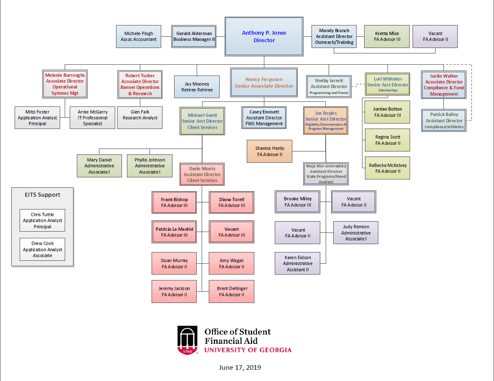

```{r setup, echo=FALSE, include=FALSE}
knitr::opts_chunk$set(echo = TRUE)
source(here::here("/lib", "render_toc.R"))
```

## Table of Contents

```{r toc-01, echo=FALSE}
render_toc("01-Student-Financial-Aid-Summary.Rmd")
```

```{r toc-02, echo=FALSE}
render_toc("02-COA.Rmd")
```

```{r toc-03, echo=FALSE}
render_toc("03-Financial-Aid-Awarded.Rmd")
```

```{r toc-04, echo=FALSE}
render_toc("04-Types-and-Sources-of-Aid.Rmd")
```

```{r toc-05, echo=FALSE}
render_toc("05-Academic-Year-Awards-by-Type.Rmd")
```

```{r toc-06-hope, echo=FALSE}
render_toc("06-HOPE-Scholarship-Awards-by-Tier.Rmd")
```

```{r toc-06-zell, echo=FALSE}
render_toc("06-ZELL-Scholarship-Awards-by-Tier.Rmd")
```

```{r toc-07-hope-zell, echo=FALSE}
render_toc("07-HOPE-ZELL-Scholarship-Awards-by-Tier.Rmd")
```
```{r toc-08-hope-zell-awd-tot, echo=FALSE}
render_toc("08-HOPE-ZELL-Scholarship-Award-Totals.Rmd")
```

```{r toc-09-hope-zell-max-awd, echo=FALSE}
render_toc("09-HOPE-ZELL-Max-Awards.Rmd")
```

```{r toc-10-pell-history, echo=FALSE}
render_toc("10-History-of-Average-Federal-Pell-Grant-Awards.Rmd")
```

```{r toc-11-pell-max-awd, echo=FALSE}
render_toc("11-Pell-Max-Awards.Rmd")
```

```{r toc-12-Pell-Grant-Comparison, echo=FALSE}
render_toc("12-Pell-Grant-Comparison.Rmd")
```

```{r toc-13-Student-Parent-Loan, echo=FALSE}
render_toc("13-Loan.Rmd")
```

```{r toc-14-Cohort-Default-Rates, echo=FALSE}
render_toc("14-Cohort-Default-Rates.Rmd")
```

```{r toc-18-Gap-Analysis, echo=FALSE}
render_toc("18-Gap-Analysis.Rmd")
```

```{=openxml}
<w:p><w:r><w:br w:type="page"/></w:r></w:p>
```

# OSFA Org Chart {-}

Here is the current OSFA Organization chart.

```{r label, out.width = "100%", fig.align='center', fig.cap = "OSFA Org Chart", echo=FALSE}

```

<!-- Remember each Rmd file contains one and only one chapter, and a chapter is defined by the first-level heading `#`. -->

<!-- To compile this example to PDF, you need XeLaTeX. You are recommended to install TinyTeX (which includes XeLaTeX): <https://yihui.name/tinytex/>. -->


```{=openxml}
<w:p><w:r><w:br w:type="page"/></w:r></w:p>
```

```{r include=FALSE}
# automatically create a bib database for R packages
knitr::write_bib(c(
  .packages(), 'bookdown', 'knitr', 'rmarkdown'
), 'packages.bib')
```
